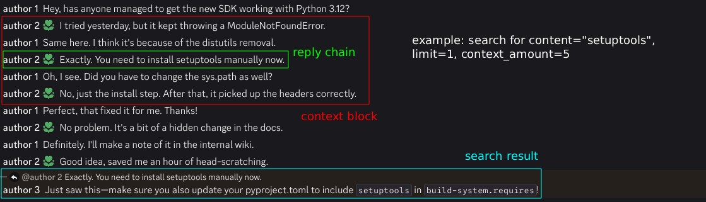

# discord-llm-scraper

Creates a queryable knowledge base from Discord conversations on specific topics.

## Why

Often I will try to contribute to an open source project by first reading the docs, and then the source, and then
joining the discord to understand why the code is written the way it is, and finally writing my PR.

I find the most time-consuming part is searching through the discord and traversing though reply chains, threads and
conversations to gain knowledge that never made it into the docs ("tribal knowledge") and discover previous attempts on
implementing the feature.

## How

1. Search - Use Discord user API to find messages containing relevant keywords
2. Traverse - Follow reply chains and surrounding context messages to build conversation chains



3. Extract - Summarizes conversations into knowledge chunks using LLMs
4. Index - Computes embeddings for semantic search capabilities
5. Query - RAG-powered question answering using conversation context

## Installation

```bash
git clone https://github.com/L9-bms/discord-llm-scraper
cd discord-llm-scraper
uv install
```

## Usage

### 1. Search and Index Conversations

```bash
uv run python src/main.py search <guild_id> "your search term" --token <discord_token>
```

### 2. Extract Knowledge and Compute Embeddings

```bash
uv run python src/main.py extract --openrouter-key <api_key>
```

### 3. Query the Knowledge Base

```bash
uv run python src/main.py ask "your query" --openrouter-key <api_key>
```

## Environment variables (optional)

```env
DISCORD_TOKEN=your_discord_token
OPENROUTER_API_KEY=your_openrouter_key
```

## Potential extensions

- Agentic search - AI search term discovery based on query
- Search within specific date ranges
- Generate markdown/HTML knowledge bases

## Warning

I didn't implement proper Discord API rate limiting handling. Try not to get your account terminated.

## Resources used

- [Discord Userdoccers](https://docs.discord.food/reference)
- [OpenAI Cookbook - Question answering using embeddings-based search](https://cookbook.openai.com/examples/question_answering_using_embeddings)
